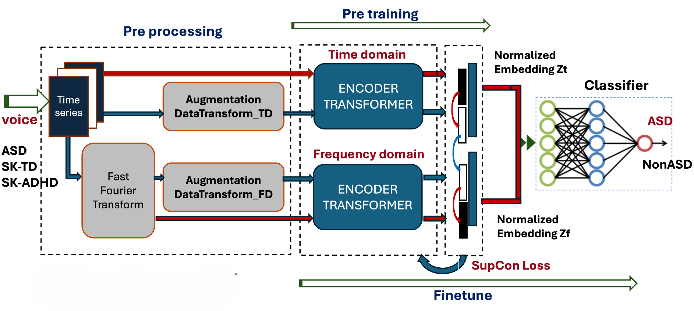
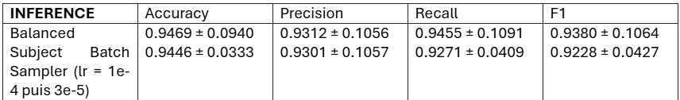
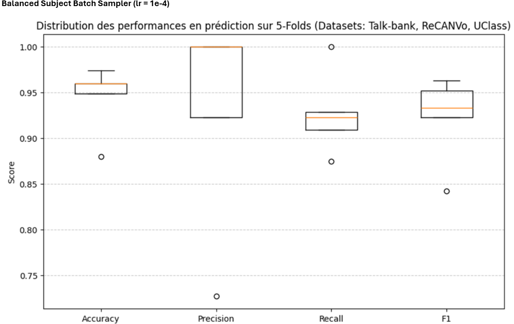
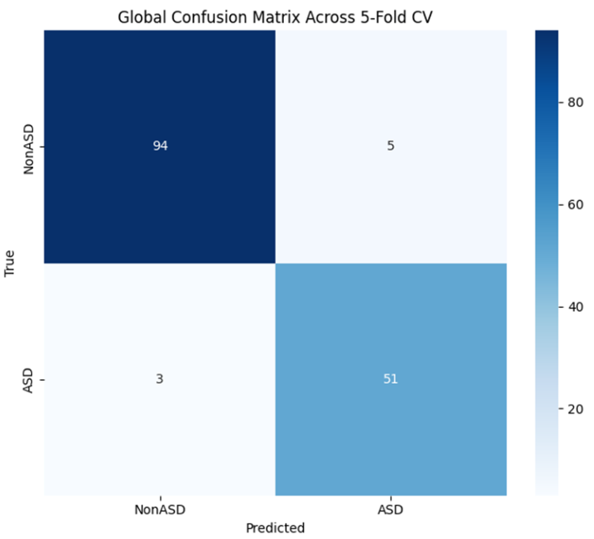

# Contrastive Representation Learning for Voice-Based Autistic Trait Identification
#### Authors: Hajarimino Rakotomanana (rhajarimino@gmail.com), Ghazal Rouhafzay (ghazal.rouhafzay@umoncton.ca), <br/>

#### Paper: [Preprint](https://doi.org/10.20944/preprints202604.1071.v1)

## 📌 Overview 

Official implementation of :

\*\*"Contrastive Representation Learning for Voice-Based Autistic Trait Identification"\*\*

This repository provides a deep learning framework for detecting autistic traits from vocal signals using contrastive learning.


The approach leverages:

\- Time-domain and frequency-domain representations of [Xiang et al.](https://zitniklab.hms.harvard.edu/projects/TF-C/)

\- Data augmentation for robust feature learning

\- Transformer-based encoders

\- Supervised Contrastive Learning of [Prannay et al.](https://arxiv.org/abs/2004.11362)


Specifically, we leverage the complementary nature of temporal and spectral voice representations to enforce cross-view consistency while explicitly incorporating diagnostic labels during training.

The proposed objective is designed to identify traits associated with Autism Spectrum Disorder (ASD) by simultaneously minimizing intra-class variability and maximizing inter-class separability in the learned embedding space. By integrating label-informed contrastive constraints, the model promotes more discriminative representations and improves robustness to inter-speaker variability, thereby enhancing generalization to previously unseen individuals.

<p align="center">
    
</p>

The figure above provides an overview of the proposed pipeline. The architecture consists of three main stages: (i) time–frequency feature extraction and dual-branch encoding, (ii) supervised contrastive representation learning, and (iii) downstream fine-tuning with a lightweight classification head. The figure illustrates how temporal and spectral representations are jointly optimized under contrastive supervision before being transferred to the diagnostic classification task.

## 🧠 Key Features

\- Automated extraction of vocal biomarkers:
  - Atypical Prosody
  - Vocal Instability (increased frequency instability "jitter" and amplitude instability "shimmer")
  - Abnormal Resonance and Timbre: Deviations in formant frequencies and spectral energy distribution

\- Multimodal contrastive learning (time + frequency) by using two encoder-transformers and supervised contrastive loss (SupCon)

\- Robust to heterogeneous datasets (Dutch + ReCANVo + UClass) by using:
  - Intra-Subject Bias Mitigation: Implemented a custom batch sampler at the DataLoader level to balance participant contributions, preventing individuals with highly frequent segments from dominating the training batch.
  - Inter-Cohort Bias Reduction (Domain Adaptation): Integrated a Gradient Reversal Layer (GRL) to encourage the model to extract domain-invariant representations across the TalkBank, ReCANVo, and UCLASS datasets. This shifts the model's focus away from dataset-specific artifacts and onto core vocal biomarkers associated with autism.
  

\- Works on verbal and non-verbal vocalizations

\- Cross-Validation, we use **StratifiedGroupKFold** to ensure robust model evaluation. This approach:    
- Prevents data leakage by keeping all samples from the same participant within a single fold.  
- Preserves the ASD/Non-ASD class distribution across folds.  
- Provides reliable and unbiased performance estimates through strict subject-level separation.  


\---


## 🏗️ Project Structure

src/

models/ "TF-C model and MLP classifier"

datasets/ "Data loading pipeline"

augmentation/ "Data augmentation"

training/ "Training in cross-validation and loss function"

evaluation/ "Testing and metrics"

data/ "Dataset instructions"

configs/ "Hyperparameters used: weight decay, learning rate, dropout, d_model, dim_feedforward, batch_size, chunk duration..."


\---


## ⚙️ Installation and Setup (Windows 11 + VS Code)

### 1. Clone the repository  
```bash
cd <git local repository>  
git clone https://github.com/hafakoa/contrastive.git  
cd <repository_folder>
```
### 2. Create a Python virtual environment  
```bash
python -m venv asd_env  
```
### 3. Allow PowerShell script execution (current session only)  
If PowerShell prevents the activation script from running, execute:  
```bash
Set-ExecutionPolicy -ExecutionPolicy RemoteSigned -Scope Process  
```
### 4. Activate the virtual environment  
```bash
.\asd_env\Scripts\Activate.ps1

(asd_env) PS C:\path\to\project>  
```
### 5. Install project dependencies using a requirements file  
```bash
pip install --upgrade pip  
pip install -r requirements.txt  
python --version  
pip list  
```
### 6. Launch the training script  
```bash
python -m src.training.main_kfold_asd  
```


## 📊 Dataset

Datasets are not included due to privacy restrictions.
Used datasets:
ReCANVo : A Dataset of Real-World Communicative and Affective Nonverbal Vocalizations
TalkBank (Dutch)
UClass

The cohort breakdown is as follows:
TalkBank: 121 participants, including 46 with ASD and 75 without ASD (38 typically developing participants – TD – and 37 participants with ADHD). The recordings consist primarily of articulated speech.
ReCANVo: 8 participants with ASD who primarily produce non-verbal vocalizations.
UClass: 24 participants with non-ASD (12 women and 12 men) who stutter, as well as 8 participants with ASD. The recordings consist of articulated speech.

Data instructions are found at data/README.md  


## 📈 Results
The entire corpus comprises **153 participants**, distributed as follows:  
54 participants with autism spectrum disorder (ASD);  
99 non-autistic participants (Non-ASD).  
- Inference with unseen data
<p align="center">
    
</p>

- Performance distribution in 5-fold prediction for three different datasets
<p align="center">
    
</p>

- Global confusion matrix across 5-Fold CV
<p align="center">
    
</p>


## 📎 Citation

@article{yourpaper2025,

&#x20; title={Contrastive Representation Learning for Voice-Based Autistic Trait Identification},

&#x20; author={Hajarimino Rakotomanana, Ghazal Rouhafzay},

&#x20; journal={Machine Learning and Knowledge Extraction},

&#x20; year={2025}

}

## ⚠️ Disclaimer

This tool is for research purposes only and is not intended for clinical diagnosis.

## 🙏 License & Acknowledgements

Inspired by contrastive learning frameworks such as SupContrast, TF-C.

This project incorporates code from [TF-C Pretraining](https://github.com/mims-harvard/TFC-pretraining) by the Zitnik Lab at Harvard, which is licensed under the MIT License.

### Original Copyright Notice:
Copyright (c) 2022 Machine Learning for Medicine and Science @ Harvard

A copy of the full MIT License text is included in the [LICENSE](./LICENSE) file of this repository.


\---


## 📦 `requirements.txt`

The full requirements.txt are included in the [requirements.txt](./requirements.txt) file of this repository.

```txt

torch

librosa

huggingface_hub

transformers

scikit-learn

matplotlib

scipy

tqdm
